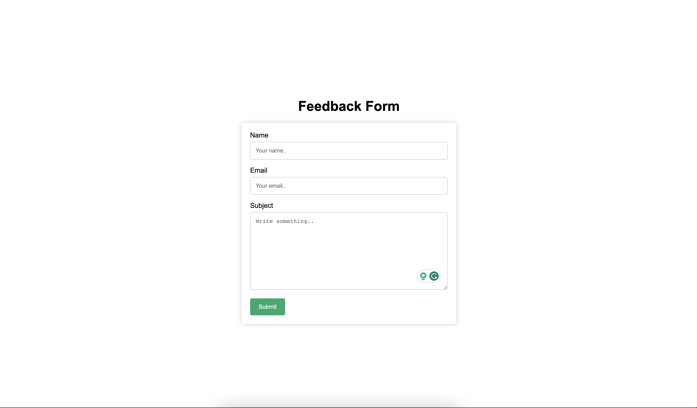
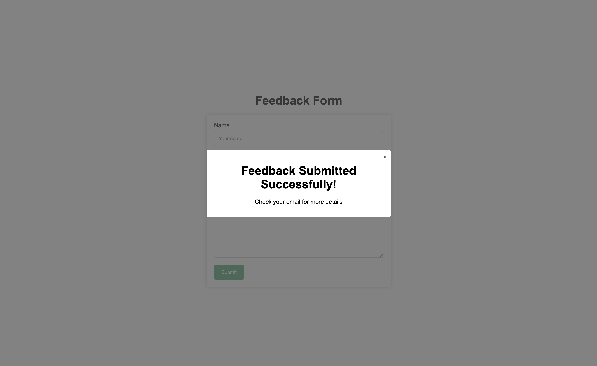

# Feedback Collection App




The Feedback Collection App is a web application designed to collect valuable feedback and opinions from users. It offers a user-friendly interface for users to submit their feedback, which is then stored in a database and can trigger email notifications to a support team and the user.

## Table of Contents

-   [Features](#features)
-   [Getting Started](#getting-started)
-   [Prerequisites](#prerequisites)
-   [Installation](#installation)
-   [Configuration](#configuration)
-   [Usage](#usage)
-   [Contributing](#contributing)
-   [License](#license)
-   [Author](#author)

## Features

-   **User-Friendly Interface**: An intuitive feedback form for users to submit their thoughts and opinions.

-   **Backend API**: Built with Node.js and MongoDB, it provides a robust backend to handle feedback submissions.

-   **Email Notifications**: Utilizes SendGrid to send email notifications to a support team upon receiving new feedback.

-   **Responsive Design**: The frontend is developed with React.js, ensuring a responsive and visually appealing user interface.

## Getting Started

These instructions will help you set up and run the Feedback Collection App on your local machine.

### Prerequisites

You will need the following tools and technologies to run the application:

-   [Node.js](https://nodejs.org/) (v18 or higher)
-   [MongoDB](https://www.mongodb.com/) (Make sure MongoDB is installed and running locally or provide a connection string to a MongoDB server.)

### Installation

1. Clone this repository to your local machine:

    ```bash
    git clone https://github.com/davydocsurg/feedback-collection-app.git
    ```

2. Change to the project's backend directory and install the dependencies:

    ```bash
    cd feedback-collection-app/backend
    npm install
    ```

3. Do the same for the frontend

### Configuration

To configure the application, you'll need to set some environment variables. Create a .env file in the project's backend directory and add the following:

```bash
# MongoDB Connection String
MONGO_URI=your_mongodb_uri_here

# SendGrid API Key
SENDGRID_API_KEY=your_sendgrid_api_key_here

# Sender Email Address
FROM_EMAIL=your_sender_email_here

# Sender Name
FROM_EMAIL=your_sender_name_here

# Support Team Email Address
SUPPORT_EMAIL=your_support_email_here
```

Replace the placeholders with your actual MongoDB URI, SendGrid API key, sender email address, and support team email address.

### Usage

Start the backend:

```bash
cd feedback-collection-app/backend && npm run dev
```

Start the frontend:

```bash
cd feedback-collection-app/frontend && npm run dev
```

Open your browser and visit http://localhost:5136 to access the Feedback Collection App.

### Contributing

Contributions are welcome! Feel free to open issues or pull requests to help improve this project.

### License

This project is licensed under the MIT License

### Author

David Ndubuisi

Linkedin: https://linkedin.com/in/davydocsurg

GitHub: https://github.com/davydocsurg

Twitter: https://twitter.com/davydocsurg
